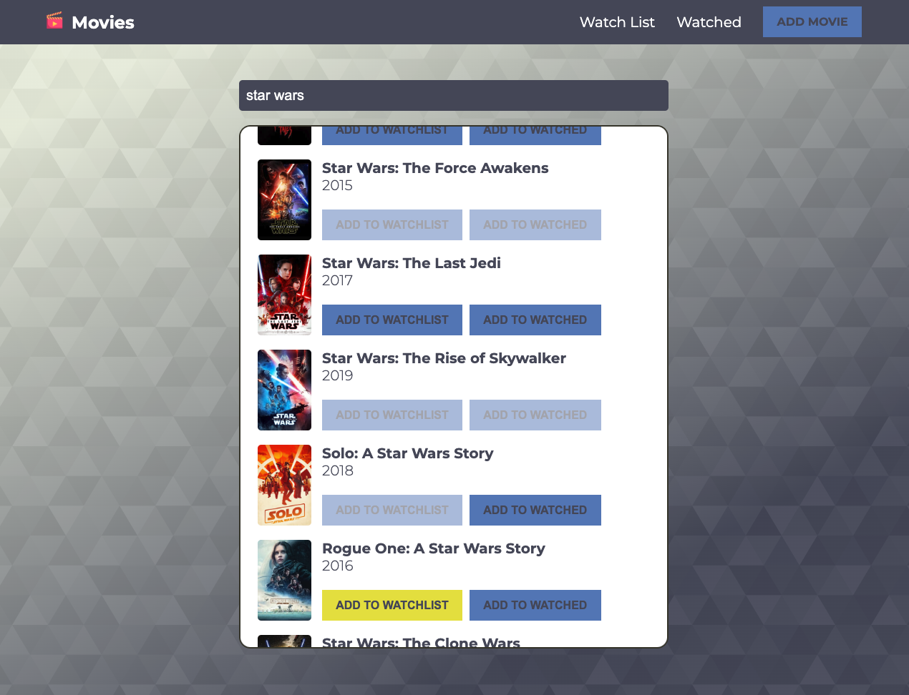
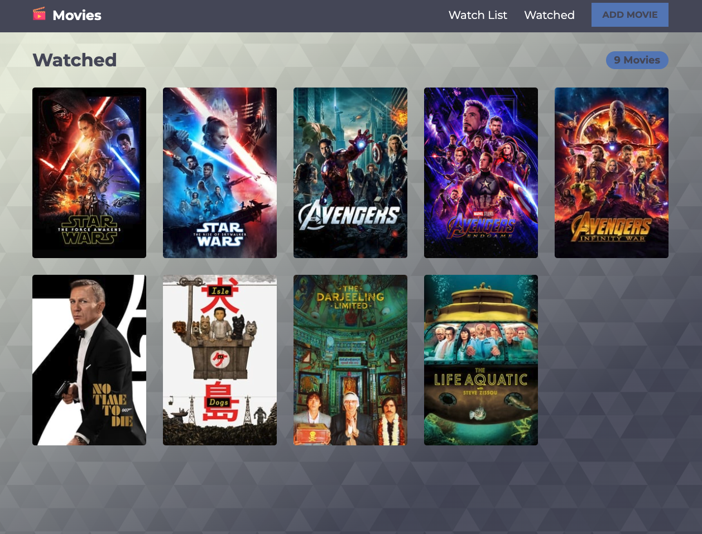

# React Watchlist App

This React app is designed to help users keep track of what movies they might like to watch or have already watched. It uses the OMDB API for the movie data, React Context API for state management, and local storage for client-side data persistence.

## Tech Stack

**Client:** React, React Router v6, Context API

## Demo

App can be found at the following [link](https://react-watchlist-app-mo.netlify.app/).

## Screenshotss

## Lessons Learned

- The main goal of this project was to get some hands on with the new major version of React Router and the Context API. Whilst it can be slightly more time consuming to set up Context, I found that it definitely paid dividends once it was all working by making state management easier to track.

## Roadmap

- styled-components
- Add authentication
- Add TV shows watchlist
